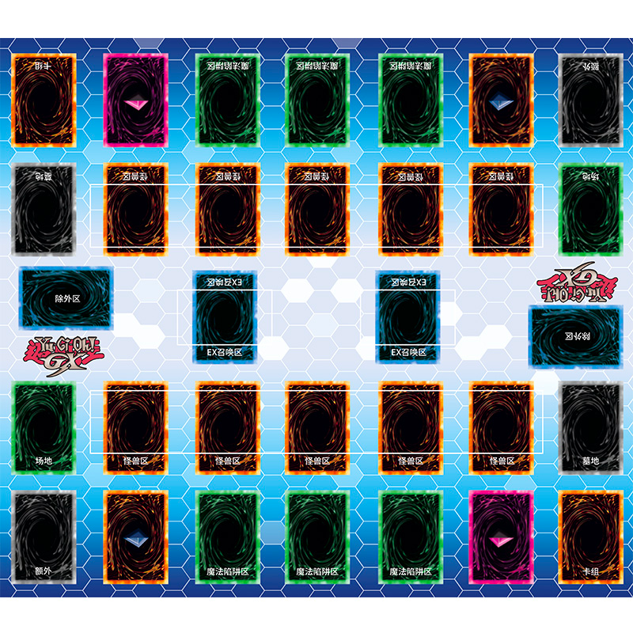

### 胜利条件
hp=0,无卡可抽,卡片效果
### 其他
每人8000
### 场地
怪兽X5，墓地 
魔/陷X5，卡组(30张)额外(10)
### 怪兽卡
ATK,DEF,星级，种族(...)，属性(暗光等),字段 
通常怪兽(无效果),效果怪兽，衍生物(实际都是一类，白板+效果)
### 召唤
通常召唤(一次),<=4直接召唤，5～6解放一只，>=7需要2个 
只能攻击或防御表示，且默认攻击表示，每回合一次改变状态的机会 
特殊召唤不限制次数，一些满足条件可以直接拉无需额外或手牌有 
### 战斗阶段
攻击表示的可以，都是攻击表示的破坏并受伤差额，防守的大于仅破坏
不受伤，小于攻击者受伤，不破坏，有怪兽不能直接攻击对方
### 魔法卡与陷阱卡
魔法卡：名称,类型，说明 
陷阱卡：名称，类型，说明 
魔法卡，立即生效的，一直生效的(对自己或对大家，或其他人的)
，用于装备(目标状态改变，死亡破坏)的，用来召唤怪兽的(仪式魔法，仅是一个Tag) 
陷阱卡，被动发动无法主动，有一次性与永久的，不明示(类似手牌中的魔法卡)
### 主要阶段
抽卡阶段(默认1张)，准备阶段(各种初始化事件，怪兽事件)，出牌阶段(出
牌，召唤，调整现有怪兽,调用怪兽主动技能)，攻击阶段(仅攻击与被动)，
弃牌阶段(最多保留6张)，结束阶段
### 发动效果时机
场上，手牌，墓地都是可以的，各种区域的卡都是一个对象
### 场地

不要场地魔法卡区域，使用除外区替换，不要EX，灵摆区
说明区域330*480，下方330*240为文本说明，可能有翻页需求，
卡片75*110，间距 50 * 12   ，决斗判最右边距62，最左边距
63，

以上 >= 以下  <=

额外卡组 可以直接点击特殊召唤 ，各有各的条件，满足即可
墓地 也可以点开，发动墓地卡的效果
卡组也可以点开，发动效果

canSelect函数  选择卡牌 用于其他作用 时进行校验
使用位运算完成

效果事件，在Param 中使用  位运算 传递 多个 一个效果可能包含
多个步骤,多个步骤可以实现IOrder接口排序

### TODO
效果需要进行分类，都放到一块，无效效果时，正常的攻击，上场也会受
影响，进行分类，方便对不同的效果进行无效
增益效果不才用循环，在需要变化时进行更新，提供更新函数
step进行分类复用，使用step组装成action
亡语技能挂载在人物或公共技能挂载点上
